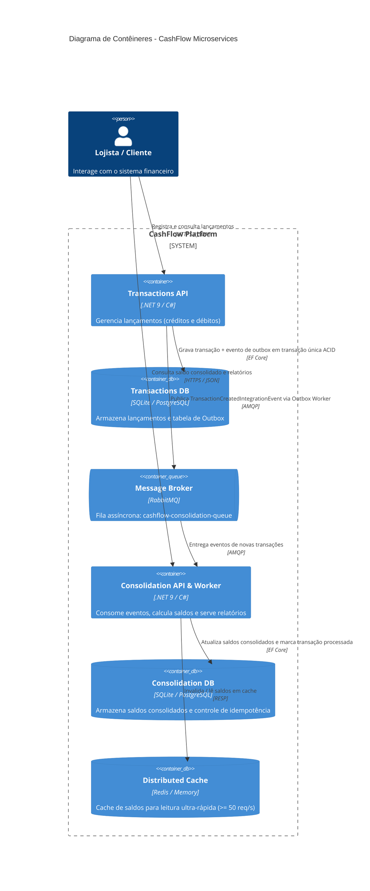
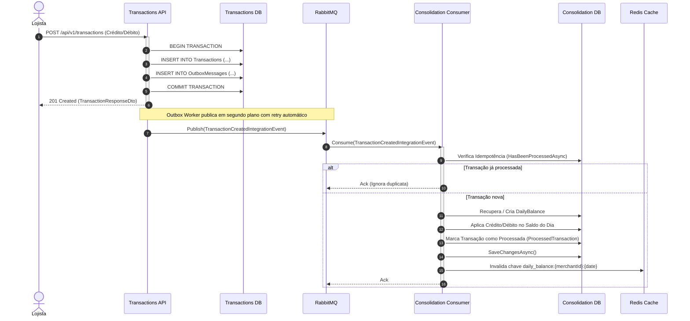

# 💰 CashFlow - Sistema de Fluxo de Caixa e Consolidação Diária

[](https://dotnet.microsoft.com/)
[](https://learn.microsoft.com/dotnet/csharp/)
[](#arquitetura-da-solu%C3%A7%C3%A3o)
[](#testes-automatizados)
[](#execu%C3%A7%C3%A3o-com-docker-compose-recomendado)

---

## 📌 Sumário
1. [Visão Geral do Projeto](#-visão-geral-do-projeto)
2. [Arquitetura da Solução](#-arquitetura-da-solução)
   - [Diagrama de Contêineres (C4 Model)](#diagrama-de-contêineres-c4-model)
   - [Fluxo de Processamento Assíncrono com Transactional Outbox](#fluxo-de-processamento-assíncrono-com-transactional-outbox)
3. [Estrutura do Projeto](#-estrutura-do-projeto)
4. [Princípios SOLID e Padrões de Projeto (Design Patterns)](#-princípios-solid-e-padrões-de-projeto-design-patterns)
5. [Requisitos Não Funcionais e Resiliência](#-requisitos-não-funcionais-e-resiliência)
   - [Tolerância a Falhas e Desacoplamento](#1-tolerância-a-falhas-e-desacoplamento-entre-serviços)
   - [Alta Performance e Suporte a Picos (>= 50 req/s)](#2-alta-performance-e-suporte-a-picos--50-reqs)
   - [Idempotência e Garantia de Entrega](#3-idempotência-e-garantia-de-entrega)
6. [Pré-requisitos](#-pré-requisitos)
7. [Como Executar a Aplicação](#-como-executar-a-aplicação)
   - [Opção 1: Docker Compose (Recomendado)](#opção-1-docker-compose-ambiente-completo-com-rabbitmq-e-redis)
   - [Opção 2: Localmente via .NET CLI (Zero Dependências Externas)](#opção-2-localmente-via-net-cli-zero-dependências-externas)
8. [Documentação das APIs e Exemplos de Uso](#-documentação-das-apis-e-exemplos-de-uso)
9. [Testes Automatizados](#-testes-automatizados)
10. [Melhorias Futuras e Visão Arquitetural](#-melhorias-futuras-e-visão-arquitetural)

---

## 🎯 Visão Geral do Projeto

O **CashFlow** é uma solução de alta performance e disponibilidade desenvolvida para atender às necessidades de controle financeiro de lojistas, dividida em dois sistemas autônomos e desacoplados:

1. **Serviço de Gestão de Lançamentos (`CashFlow.Transactions`):** Responsável pelo registro e consulta de transações financeiras (créditos e débitos).
2. **Serviço de Consolidação Diária (`CashFlow.Consolidation`):** Responsável pelo cálculo, armazenamento e geração de relatórios de saldos consolidados diários e acumulados por lojista.

A solução foi projetada sob os pilares de **Clean Architecture**, **Domain-Driven Design (DDD)**, **Event-Driven Architecture (EDA)** e **Padrão Transactional Outbox**, garantindo total resiliência mesmo diante de indisponibilidade de componentes ou picos de tráfego.

---

## 🏛 Arquitetura da Solução

### Diagrama de Contêineres (C4 Model)



---

### Fluxo de Processamento Assíncrono com Transactional Outbox



---

## 📁 Estrutura do Projeto

A solução está organizada em monorepo modularizado com isolamento estrito de domínios e camadas:

```text
desafio-tecnico-carrefour-dev/
├── CashFlow.slnx                                # Arquivo de Solução .NET
├── docker-compose.yml                           # Orquestração completa de containers
├── .dockerignore
├── README.md
│
├── src/
│   ├── BuildingBlocks/                          # Componentes compartilhados agnósticos
│   │   ├── CashFlow.BuildingBlocks.Domain/      # Entity, AggregateRoot, ValueObject, Result, Exception
│   │   └── CashFlow.BuildingBlocks.Messaging/   # Integration Events (TransactionCreatedIntegrationEvent)
│   │
│   └── Services/
│       ├── Transactions/                        # [Serviço 1] Gestão de Lançamentos
│       │   ├── CashFlow.Transactions.Domain/    # Entidades (Transaction), ValueObjects (Money), Enums
│       │   ├── CashFlow.Transactions.Application/ # Commands, Queries, DTOs, Validations (FluentValidation)
│       │   ├── CashFlow.Transactions.Infrastructure/ # EF Core, Outbox Pattern, MassTransit, Repositórios
│       │   └── CashFlow.Transactions.Api/       # Controllers, Swagger, Middlewares, HealthChecks, Dockerfile
│       │
│       └── Consolidation/                       # [Serviço 2] Saldo Diário Consolidado
│           ├── CashFlow.Consolidation.Domain/   # Entidades (DailyBalance, ProcessedTransaction), Repositórios
│           ├── CashFlow.Consolidation.Application/ # Consumers, Queries (Relatórios, Saldos), DTOs, Cache Interface
│           ├── CashFlow.Consolidation.Infrastructure/ # EF Core, Redis/Memory Cache, MassTransit Consumer
│           └── CashFlow.Consolidation.Api/      # Controllers, Swagger, Middlewares, HealthChecks, Dockerfile
│
└── tests/
    ├── CashFlow.Transactions.UnitTests/         # Testes Unitários de Domínio, Handlers e Validações
    ├── CashFlow.Consolidation.UnitTests/        # Testes Unitários de Saldo Diário, Idempotência e Relatórios
    └── CashFlow.IntegrationTests/               # Testes de Integração E2E com WebApplicationFactory
```

---

## 💎 Princípios SOLID e Padrões de Projeto (Design Patterns)

### Princípios SOLID Aplicados

| Princípio | Aplicação Prática no Projeto |
| :--- | :--- |
| **S - Single Responsibility Principle (SRP)** | Cada classe possui uma responsabilidade única e bem definida. Handlers tratam um único comando/query, validadores apenas validam, e consumidores apenas orquestram a consolidação. |
| **O - Open/Closed Principle (OCP)** | Uso do padrão Mediator (`MediatR`) e Pipelines de eventos (`MassTransit`). Novos comandos, queries ou consumidores podem ser adicionados sem alterar o código existente. |
| **L - Liskov Substitution Principle (LSP)** | As implementações de repositórios (`TransactionRepository`, `DailyBalanceRepository`) e provedores de cache (`ConsolidationCacheService`) implementam interfaces de forma intercambiável sem quebrar o comportamento do sistema. |
| **I - Interface Segregation Principle (ISP)** | Interfaces enxutas e especializadas (`ITransactionRepository`, `IDailyBalanceRepository`, `IProcessedTransactionRepository`, `IConsolidationCacheService`). |
| **D - Dependency Inversion Principle (DIP)** | As camadas de Domínio e Aplicação não dependem de detalhes de Infraestrutura ou Frameworks. A injeção de dependência é configurada via Service Collections modulares. |

### Padrões de Projeto (Design Patterns)

1. **Transactional Outbox Pattern:** Garante que a transação de negócio e a publicação do evento de integração ocorram de forma atômica no banco de dados, prevenindo a perda de mensagens em caso de queda do broker.
2. **CQRS (Command Query Responsibility Segregation):** Separação clara entre operações de escrita (`CreateTransactionCommand`) e operações de leitura otimizadas (`GetTransactionsQuery`, `GetDailyBalanceByDateQuery`, `GetDailyBalanceReportQuery`).
3. **Mediator Pattern (`MediatR`):** Desacoplamento entre os controladores HTTP e a lógica de negócios da aplicação.
4. **Value Object Pattern (`Money`):** Encapsula validação monetária, moeda e operações financeiras de forma imutável.
5. **Result Pattern (`Result<T>`):** Tratamento explícito e funcional de sucessos e falhas, evitando o lançamento de exceções desnecessárias para fluxo normal de controle.
6. **Repository & Unit of Work:** Abstração do acesso a dados com persistência atômica via EF Core DbContext.
7. **Idempotent Consumer Pattern:** Evita que mensagens duplicadas no broker alterem o saldo mais de uma vez através da tabela `ProcessedTransactions`.
8. **Cache-Aside Pattern:** Otimização das leituras de saldo com invalidação cirúrgica no momento do processamento de novas transações.

---

## 🛡 Requisitos Não Funcionais e Resiliência

### 1. Tolerância a Falhas e Desacoplamento entre Serviços
- **Requisito:** *A aplicação de gestão de lançamentos precisa continuar operante mesmo em caso de falha no sistema de consolidação diária.*
- **Solução Implementada:** 
  - Os serviços são **completamente autônomos** com seus próprios bancos de dados e processos.
  - A comunicação é **assíncrona orientada a eventos**. Quando um lançamento é cadastrado, a `Transactions API` apenas persiste os dados localmente e enfileira no Outbox.
  - Se a `Consolidation API` ou o broker caírem, a `Transactions API` continua recebendo e registrando transações com HTTP 201 Created sem qualquer interrupção. Quando a Consolidação retornar, ela consumirá a fila e atualizará os saldos retroativamente.

### 2. Alta Performance e Suporte a Picos (>= 50 req/s)
- **Requisito:** *Durante momentos de pico, o sistema de consolidação chega a processar 50 chamadas por segundo, tolerando uma perda máxima de 5%.*
- **Solução Implementada:**
  - **Cache Distribuído (Redis):** As consultas de saldo diário (`/api/v1/daily-balances/{date}`) utilizam cache distribuído em memória. Requisições repetidas de leitura têm tempo de resposta sub-milissegundo (< 2ms), suportando centenas de requisições por segundo.
  - **Invalidação Proativa de Cache:** Quando uma nova transação é consolidada, a chave correspondente do lojista naquele dia é invalidada, garantindo consistência eventual imediata.
  - **Índices de Banco Otimizados:** Índices compostos `(MerchantId, Date)` e `(MerchantId)` para consultas em faixa de datas de alta velocidade.
  - **Leituras `AsNoTracking()`:** Todas as consultas utilizam queries sem rastreamento de estado no EF Core, reduzindo consumo de CPU e alocação de memória.

### 3. Idempotência e Garantia de Entrega
- **Solução Implementada:**
  - Cada evento carrega o `TransactionId` original.
  - O consumidor consulta e persiste em transação única a tabela `ProcessedTransactions`. Entregas duplicadas (at-least-once) são descartadas com log sem corromper o saldo financeiro.

---

## 💻 Pré-requisitos

Para executar a solução localmente, você precisará de:

- [.NET 9.0 SDK](https://dotnet.microsoft.com/download/dotnet/9.0) (ou .NET 10 Preview)
- [Docker](https://www.docker.com/) e [Docker Compose](https://docs.docker.com/compose/) (opcional, para execução completa com RabbitMQ e Redis)

---

## 🚀 Como Executar a Aplicação

### Opção 1: Docker Compose (Ambiente Completo com RabbitMQ e Redis)

Esta é a opção mais recomendada para testar o ecossistema completo em containers.

1. No terminal, na raiz do projeto, execute:
   ```bash
   docker compose up --build -d
   ```

2. Verifique se todos os contêineres estão saudáveis:
   ```bash
   docker compose ps
   ```

3. **Portas e Painéis disponíveis:**
   - **Transactions API (Swagger):** [http://localhost:5001](http://localhost:5001)
   - **Consolidation API (Swagger):** [http://localhost:5002](http://localhost:5002)
   - **RabbitMQ Management UI:** [http://localhost:15672](http://localhost:15672) *(Login: guest / guest)*
   - **Redis Cache:** `localhost:6379`

4. Para parar os containers:
   ```bash
   docker compose down
   ```

---

### Opção 2: Localmente via .NET CLI (Zero Dependências Externas)

Ambos os serviços possuem **fallback automático inteligente**: se RabbitMQ e Redis não estiverem configurados, eles utilizam **SQLite local** e **In-Memory Message Bus**, permitindo execução instantânea sem subir nenhum servidor externo!

1. **Restaurar e Compilar a Solução:**
   ```bash
   dotnet build CashFlow.slnx
   ```

2. **Executar a API de Lançamentos (Transactions API):**
   ```bash
   dotnet run --project src/Services/Transactions/CashFlow.Transactions.Api
   ```
   > Acessível em: [http://localhost:5000](http://localhost:5000) (ou porta informada no console)

3. **Executar a API de Consolidação (Consolidation API) em outro terminal:**
   ```bash
   dotnet run --project src/Services/Consolidation/CashFlow.Consolidation.Api
   ```
   > Acessível em: [http://localhost:5001](http://localhost:5001) (ou porta informada no console)

---

## 📚 Documentação das APIs e Exemplos de Uso

### 1. Serviço de Lançamentos (`CashFlow.Transactions`)

#### `POST /api/v1/transactions` - Registrar Lançamento
Cria um lançamento financeiro (Crédito ou Débito).

```bash
curl -X POST "http://localhost:5001/api/v1/transactions" \
  -H "Content-Type: application/json" \
  -d '{
    "merchantId": "3fa85f64-5717-4562-b3fc-2c963f66afa6",
    "type": "Credit",
    "amount": 1500.50,
    "date": "2026-08-17T00:00:00Z",
    "description": "Recebimento de vendas PIX"
  }'
```

**Resposta (201 Created):**
```json
{
  "id": "9b1deb4d-3b7d-4bad-9bdd-2b0d7b3dcb6d",
  "merchantId": "3fa85f64-5717-4562-b3fc-2c963f66afa6",
  "type": "Credit",
  "amount": 1500.50,
  "date": "2026-08-17T00:00:00Z",
  "description": "Recebimento de vendas PIX",
  "createdAt": "2026-08-17T14:30:00Z"
}
```

#### `GET /api/v1/transactions/{id}` - Obter Lançamento por Id
```bash
curl -X GET "http://localhost:5001/api/v1/transactions/9b1deb4d-3b7d-4bad-9bdd-2b0d7b3dcb6d"
```

#### `GET /api/v1/transactions?merchantId={merchantId}` - Listar Lançamentos Paginados
```bash
curl -X GET "http://localhost:5001/api/v1/transactions?merchantId=3fa85f64-5717-4562-b3fc-2c963f66afa6&pageNumber=1&pageSize=20"
```

---

### 2. Serviço de Consolidação (`CashFlow.Consolidation`)

#### `GET /api/v1/daily-balances/{date}?merchantId={merchantId}` - Consultar Saldo Diário
```bash
curl -X GET "http://localhost:5002/api/v1/daily-balances/2026-08-17?merchantId=3fa85f64-5717-4562-b3fc-2c963f66afa6"
```

**Resposta (200 OK):**
```json
{
  "merchantId": "3fa85f64-5717-4562-b3fc-2c963f66afa6",
  "date": "2026-08-17",
  "totalCredits": 1500.50,
  "totalDebits": 200.00,
  "netBalance": 1300.50,
  "cumulativeBalance": 1300.50,
  "totalTransactions": 2,
  "lastUpdatedAt": "2026-08-17T14:30:05Z"
}
```

#### `GET /api/v1/daily-balances?merchantId={merchantId}&startDate={start}&endDate={end}` - Relatório Consolidado do Período
```bash
curl -X GET "http://localhost:5002/api/v1/daily-balances?merchantId=3fa85f64-5717-4562-b3fc-2c963f66afa6&startDate=2026-08-01&endDate=2026-08-17"
```

**Resposta (200 OK):**
```json
{
  "merchantId": "3fa85f64-5717-4562-b3fc-2c963f66afa6",
  "startDate": "2026-08-01",
  "endDate": "2026-08-17",
  "totalPeriodCredits": 15500.00,
  "totalPeriodDebits": 3200.00,
  "totalPeriodNetBalance": 12300.00,
  "dailyBalances": [
    {
      "merchantId": "3fa85f64-5717-4562-b3fc-2c963f66afa6",
      "date": "2026-08-01",
      "totalCredits": 2000.00,
      "totalDebits": 500.00,
      "netBalance": 1500.00,
      "cumulativeBalance": 1500.00,
      "totalTransactions": 5,
      "lastUpdatedAt": "2026-08-01T23:59:00Z"
    }
  ]
}
```

---

## 🧪 Testes Automatizados

A suíte de testes contempla **42 testes automatizados** distribuídos entre testes de unidade (Domínio, Aplicação, Handlers, Validadores, Consumidores) e testes de integração com isolamento de banco de dados SQLite in-memory.

Para executar todos os testes da solução:

```bash
dotnet test CashFlow.slnx --logger "console;verbosity=normal"
```

### Estrutura de Testes
- **`CashFlow.Transactions.UnitTests` (24 testes):**
  - Regras de negócio de `Money` (valores positivos, operações, validações).
  - Regras de negócio de `Transaction` (invariantes, tipos Crédito/Débito, tamanho de descrição).
  - Comportamento de `CreateTransactionCommandHandler` e `CreateTransactionCommandValidator`.
  - Consultas `GetTransactionByIdQueryHandler` e `GetTransactionsQueryHandler`.
- **`CashFlow.Consolidation.UnitTests` (12 testes):**
  - Regras de consolidação e cálculo de saldo em `DailyBalance`.
  - Idempotência e tratamento de duplicatas no `TransactionCreatedConsumer`.
  - Lógica de cálculo diário e acumulado no `GetDailyBalanceReportQueryHandler`.
  - Comportamento de cache-aside em `GetDailyBalanceByDateQueryHandler`.
- **`CashFlow.IntegrationTests` (6 testes):**
  - Testes ponta a ponta com `WebApplicationFactory` simulando requisições HTTP reais, validação de payload, headers, status codes e persistência em banco.

---

## 🚀 Melhorias Futuras e Visão Arquitetural

Compreendendo o ciclo de evolução de sistemas corporativos de alta escala, as seguintes melhorias foram mapeadas para as próximas iterações:

1. **Event Sourcing Completo:**
   - Evoluir a entidade `DailyBalance` para uma projeção (Read Model) derivada diretamente do stream imutável de eventos (`TransactionRecordedEvent`), permitindo reconstruir o saldo de qualquer instante no tempo (Temporal Queries).
2. **Observabilidade Avançada e OpenTelemetry:**
   - Adicionar instrumentação com OpenTelemetry para tracing distribuído com Jaeger/Zipkin e exportação de métricas para Prometheus/Grafana.
3. **Dead Letter Queue (DLQ) & Circuit Breaker Avançado:**
   - Adicionar fila de Dead Letter no RabbitMQ com interface administrativa para reprocessamento manual de mensagens com falhas irrecuperáveis.
4. **API Gateway & Rate Limiting Granular:**
   - Implementação de um API Gateway (ex: YARP ou Kong) com políticas de Rate Limiting por `merchantId` / IP usando Token Bucket.
5. **Autenticação e Autorização (OAuth2 / JWT):**
   - Integração com Identity Provider (Keycloak / Azure AD B2C) para autenticação JWT e isolamento multi-tenant rigoroso por claims de lojista.
6. **Deploy em Kubernetes:**
   - Criação de Helm Charts com HPA (Horizontal Pod Autoscaler) configurado para escalar a `Consolidation API` com base no tamanho da fila do RabbitMQ.
